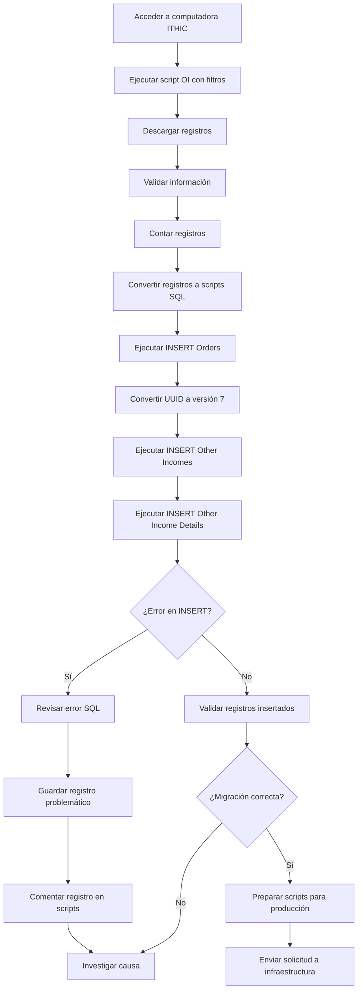

# Proceso de Migración de Grupos

## 1. Acceso al entorno de extracción de datos

1. Acceder a la computadora de **ITHIC** donde se encuentra el script de **OI**.
2. Ejecutar el script aplicando los filtros correspondientes al grupo que se desea migrar.
3. Generar las consultas necesarias para obtener los registros requeridos o para preparar los scripts de inserción.

---

## 2. Validación de registros

Antes de ejecutar cualquier inserción:

1. Revisar los registros extraídos.
2. Confirmar que la información sea correcta.
3. Realizar un conteo de registros para validar que la información esté completa.

Ejemplo de validación:

```
COUNT Orders  
COUNT Other Incomes  
COUNT Other Income Details  
```

Los conteos deben ser consistentes con los datos esperados.

---

## 3. Orden de ejecución de los scripts

Los scripts deben ejecutarse en un orden específico para evitar errores de integridad referencial.

Orden de ejecución:

1. **Orders**
   - Antes de ejecutar los inserts, se debe convertir el **UUID de los registros a versión 7**.

2. **Other Incomes**

3. **Other Income Details**

> [!NOTE]
> Los registros deben ser idénticos entre **Orders** y **Other Incomes**.

---

## 4. Proceso de carga de datos

1. Acceder a la computadora de **ITHIC**.
2. Descargar los registros requeridos.
3. Transferir los archivos mediante:
   - WhatsApp
   - Google Drive
   - u otro medio autorizado.
4. Convertir los registros a scripts SQL.
5. Ejecutar los scripts en el siguiente orden:

```
1. Orders  
2. Other Incomes  
3. Other Income Details  
```

---

## 5. Manejo de errores

Si durante la ejecución ocurre un error en algún INSERT:

1. Revisar el mensaje de error generado por SQL.
2. Verificar si el problema se debe a:
   - Campos faltantes
   - Llaves foráneas inexistentes
   - Datos incompletos
3. Si se detecta un problema con un registro:
   - Guardar el registro problemático.
   - Comentar el registro en los tres scripts.
   - Continuar con la ejecución de los demás registros.
4. Posteriormente iniciar la investigación del problema para determinar el origen del error.

> [!IMPORTANT]
> Ante cualquier error crítico, **no continuar** con la ejecución hasta haber identificado la causa raíz.

---

## 6. Validación posterior a la migración

Si la migración se ejecuta correctamente:

1. Validar que los registros se hayan insertado correctamente.
2. Ejecutar consultas de verificación.

```sql
SELECT * FROM Orders WHERE group_id = X;

SELECT * FROM Other_Incomes WHERE group_id = X;

SELECT * FROM Other_Income_Details WHERE group_id = X;
```

3. Confirmar que:
   - el número de registros coincida
   - las relaciones entre tablas sean correctas

---

## 7. Proceso para producción

Si los resultados son correctos y la migración debe aplicarse en producción:

1. Preparar los scripts finales.
2. Validar nuevamente los datos.
3. Ejecutar el procedimiento de despliegue.
4. Enviar una solicitud al equipo de infraestructura para cargar los datos a producción.

La solicitud debe incluir:

- Scripts SQL
- Evidencia de pruebas
- Validaciones realizadas

---

# Diagrama de Flujo del Proceso


