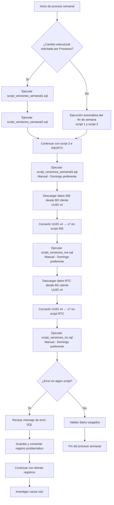

# Proceso de Ejecución de Scripts Semanales de Versiones

## 1. Scripts involucrados

Para esta actividad se cuenta con los siguientes scripts principales, los cuales deben ejecutarse en el orden indicado ya que existe una dependencia entre ellos por relaciones de integridad referencial:

| # | Script | Descripción |
|---|--------|-------------|
| 1 | `script_versiones_semanal1.sql` | Crea las tablas de versiones en SQL |
| 2 | `script_versiones_semanal2.sql` | Carga todos los catálogos necesarios para realizar pruebas en versiones |
| 3 | `script_versiones_semanal3.sql` | Carga de datos semanales de versiones (ejecución manual) |
| 4 | `script_versiones_ine.sql` | Carga de datos de versiones INE (ejecución manual) |
| 5 | `script_versiones_rtc.sql` | Carga de datos de versiones RTC (ejecución manual) |

> [!IMPORTANT]
> El orden de ejecución es estricto. Si se altera, se producirán errores de integridad referencial por las relaciones entre tablas.

---

## 2. Scripts 1 y 2 — Estructura y catálogos

### `script_versiones_semanal1.sql`

Este script se encarga de **crear las tablas de versiones** en la base de datos. Es el primer script que debe ejecutarse.

### `script_versiones_semanal2.sql`

Este script **carga todos los catálogos necesarios** para realizar pruebas en versiones. Depende de que el script 1 haya sido ejecutado previamente.

### Modo de ejecución

Estos dos scripts se **cargan de forma automática cada fin de semana**. Solo se ejecutarán de manera manual en los siguientes casos:

- Cuando el equipo de Procesos realice algún requerimiento relacionado con cambios en tablas o columnas.

> [!NOTE]
> Cualquier cambio estructural (tablas o columnas) se maneja **únicamente** en los scripts 1 y 2. No se deben modificar estos cambios en otros scripts.

---

## 3. Script 3 — Carga semanal de datos

### `script_versiones_semanal3.sql`

Este script realiza la carga semanal de datos de versiones.

### Modo de ejecución

- Este script se ejecuta **siempre de forma manual**, sin excepción.
- Se corre **preferentemente cada domingo**.
- Si no es posible ejecutarlo el domingo, puede ejecutarse el **lunes muy temprano**.

> [!IMPORTANT]
> Los dominios **ventas2**, **programacionj** y **trafico** dependen de los datos que carga este script. Ejecutarlo tarde el lunes puede afectar su operación. Priorizar siempre la ejecución dominical.

---

## 4. Scripts INE y RTC — Carga semanal de datos externos

### `script_versiones_ine.sql` y `script_versiones_rtc.sql`

Estos scripts realizan la carga de datos provenientes de fuentes externas (INE y RTC respectivamente).

### Modo de ejecución

- Ambos scripts se ejecutan **siempre de forma manual**, sin excepción.
- Se corren **preferentemente cada domingo**.
- Si no es posible ejecutarlos el domingo, pueden ejecutarse el **lunes muy temprano**.

> [!IMPORTANT]
> Al igual que el script 3, los dominios **ventas2**, **programacionj** y **trafico** dependen de los datos que cargan estos scripts. Ejecutarlos tarde el lunes puede afectar su operación.

### Conversión de UUID v4 a UUID v7

> [!IMPORTANT]
> Los datos de INE y RTC se descargan desde la base de datos del cliente en **UUID versión 4**. Antes de ejecutar cualquier inserción, los identificadores **deben convertirse a UUID versión 7**. Este paso es obligatorio y debe realizarse con cuidado antes de cargar los scripts.

Pasos a seguir para INE y RTC:

1. Descargar los registros desde la base de datos del cliente.
2. Identificar todos los campos UUID en el script descargado.
3. Convertir cada UUID de versión 4 a **versión 7** antes de ejecutar el script.
4. Verificar que la conversión sea correcta antes de proceder con la carga.

---

## 5. Resumen de tiempos y modalidad de ejecución

| Script | Ejecución automática | Ejecución manual | Día preferente | Límite máximo |
|--------|---------------------|-----------------|----------------|---------------|
| `script_versiones_semanal1.sql` | Cada fin de semana | Solo si hay cambios estructurales | — | — |
| `script_versiones_semanal2.sql` | Cada fin de semana | Solo si hay cambios estructurales | — | — |
| `script_versiones_semanal3.sql` | No | Siempre | Domingo | Lunes muy temprano |
| `script_versiones_ine.sql` | No | Siempre | Domingo | Lunes muy temprano |
| `script_versiones_rtc.sql` | No | Siempre | Domingo | Lunes muy temprano |

---

## 6. Manejo de errores

Si durante la ejecución ocurre un error en algún script:

1. Revisar el mensaje de error generado por SQL.
2. Verificar si el problema se debe a:
   - Dependencias no resueltas (script ejecutado fuera de orden)
   - UUID no convertidos correctamente (aplica para INE y RTC)
   - Campos faltantes o datos incompletos
   - Llaves foráneas inexistentes
3. Si se detecta un registro problemático:
   - Guardar el registro con el error.
   - Comentar el registro en el script.
   - Continuar con la ejecución de los demás registros.
4. Iniciar la investigación del registro problemático para determinar el origen del error.

> [!IMPORTANT]
> Ante cualquier error crítico, **no continuar** con la ejecución hasta haber identificado la causa raíz.

---

# Diagrama de Flujo del Proceso

